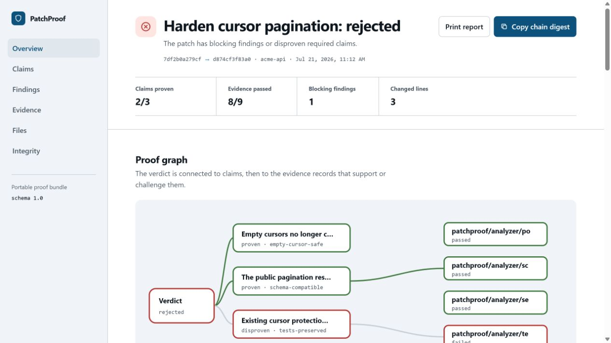

# PatchProof

Independent, inspectable evidence for AI-written code.

PatchProof turns a Git patch into a portable proof bundle: the exact diff, a policy anchored to the trusted base commit, deterministic analyzer results, test and build output, falsifiable claims, and an optional Ed25519 signature. It is designed for teams that want stronger review evidence than "the coding agent says it works."

PatchProof is local by default. No model is required to verify a patch. A local Ollama model, or an explicitly configured OpenAI-compatible endpoint, can optionally draft a contract; the final verdict remains deterministic.



## What it checks

- The verification policy came from the trusted base commit and was not changed by the patch.
- Changed paths stay inside declared scope and below size limits.
- Tests were not deleted, skipped, or obviously weakened.
- Source changes include a qualifying test change when policy or contract requires one.
- Added text does not match supported credential patterns.
- Dependency manifest and lockfile changes receive structural review.
- Command evidence runs only from a clean checkout at the exact candidate head.
- Required repository commands pass.
- Every contract claim has the evidence it declared in advance.
- The complete proof content, derived claims/verdict, evidence order, and optional signature remain internally consistent.

PatchProof does **not** prove arbitrary semantic correctness, sandbox commands, scan the whole repository for secrets, query vulnerability databases, or establish the real-world identity of a signing key. See [the threat model](docs/threat-model.md).

## Requirements

- Node.js 20.12 or newer
- Git available on `PATH`
- A Git repository with a committed PatchProof policy at the selected base ref

## Install from this checkout

```sh
npm ci
npm run build
npm install --global .
patchproof --version
```

For a project-local install from the npm release, use the scoped package; the executable remains `patchproof`:

```sh
npm install --save-dev @giancoferrari/patchproof
npx patchproof --version
```

## Five-minute workflow

Run initialization on the repository's trusted base branch, inspect the generated files, and commit them before asking PatchProof to verify later changes:

```sh
patchproof init
patchproof doctor
git add .gitignore .patchproof/policy.yml .patchproof/contract.yml
git commit -m "chore: establish PatchProof policy"
```

Create the implementation branch, make the source and test changes, and commit them. Then verify the committed patch from a clean checkout:

```sh
git switch -c feature/verified-change
# Make and commit the implementation and its tests.
patchproof verify --base main --head HEAD --sarif patchproof.sarif
```

By default PatchProof writes:

- one `.json` file named after the generated proof ID: the source-of-truth proof bundle
- one `.html` file with the same generated proof ID: a standalone offline report
- the path passed to `--sarif`: optional SARIF 2.1.0 findings

Use explicit paths when another tool needs stable filenames:

```sh
patchproof verify --base main --head HEAD \
  --output patchproof.json \
  --report patchproof.html \
  --sarif patchproof.sarif \
  --json
```

Exit codes are stable automation inputs:

| Code | Meaning |
| ---: | --- |
| `0` | `verified`: no current rejection or incompleteness condition applies |
| `1` | `rejected`, a verification error, or invalid CLI usage |
| `2` | `incomplete`: no blocking failure, but required evidence is missing or skipped |

### Evidence is bound to the checkout

The diff is computed between committed refs. Before and after running commands, PatchProof requires the checkout to be clean and its `HEAD` to equal the resolved candidate head. A mismatch stops verification. This keeps command evidence and the committed patch aligned:

```sh
git status --porcelain
git rev-parse HEAD
patchproof verify --base main --head HEAD
```

The first command should print nothing, and `HEAD` must be the commit being verified. `--no-commands` intentionally skips these checkout guards along with command execution.

## Policy and contract

`patchproof init` detects common `package.json` scripts and creates two strict YAML documents:

- `.patchproof/policy.yml` defines trusted commands, explicit environment inheritance, scope, thresholds, analyzers, and names of environment variables whose values must be redacted. Verification reads it from the base commit by default.
- `.patchproof/contract.yml` defines falsifiable claims and the exact command, rule, path, or test-change evidence required for each claim.

Unknown fields, duplicate identifiers, disabled-rule references, and unknown command references are rejected. Read [Policies and contracts](docs/policies-and-contracts.md) for complete schemas and examples.

## Commands

| Command | Purpose |
| --- | --- |
| `patchproof init` | Create policy, contract, and ignore entries without replacing existing configuration |
| `patchproof doctor` | Check Node.js, Git, and configuration readiness |
| `patchproof verify` | Build a proof from a committed base/head comparison |
| `patchproof report PROOF_FILE` | Render an internally consistent bundle as standalone HTML |
| `patchproof keygen` | Create a local Ed25519 key pair |
| `patchproof sign PROOF_FILE` | Sign an existing bundle |
| `patchproof verify-bundle PROOF_FILE` | Check digests, the evidence chain, and any embedded signature |
| `patchproof contract` | Draft a contract through Ollama or an explicit OpenAI-compatible endpoint |

Run `patchproof COMMAND --help` for all options.

### Skip command execution

```sh
patchproof verify --base main --no-commands
```

Configured commands are recorded as `skipped`; required commands therefore produce an `incomplete` verdict. This is useful for inspecting deterministic findings without claiming full verification.

### Working-tree policy escape hatch

```sh
patchproof verify --base main --trust-working-policy
```

This changes the policy seal source to `explicit-file`. It is intentionally weaker because the candidate checkout controls the policy. Use it for policy development, not as equivalent evidence to a base-anchored policy.

## Sign and verify a bundle

```sh
patchproof keygen
patchproof verify --base main \
  --output patchproof.signed.json \
  --report patchproof.signed.html \
  --sign-key .patchproof/keys/patchproof-private.pem
patchproof verify-bundle patchproof.signed.json
```

The private-key directory is added to `.gitignore` by `patchproof init`. Every bundle has a whole-content digest and recomputable consistency checks. A valid embedded signature additionally proves that the complete bundle was attested by possession of that key; consumers must still obtain the expected public-key fingerprint through a trusted channel. Details are in [Proof bundles](docs/proof-bundle.md).

## GitHub Action

The repository includes a composite action. Checkout history is required so PatchProof can resolve the trusted base:

```yaml
name: PatchProof
on:
  pull_request:
    branches: [main]

permissions:
  contents: read

jobs:
  verify:
    runs-on: ubuntu-latest
    steps:
      - uses: actions/checkout@v6
        with:
          fetch-depth: 0
          persist-credentials: false
      - id: patchproof
        uses: giancoferrari/patchproof@v0.1.0
        with:
          base-ref: origin/main
          head-ref: HEAD
          setup-command: npm ci --ignore-scripts --no-audit --no-fund
          proof-path: .patchproof/proofs/patchproof.json
          report-path: .patchproof/proofs/patchproof.html
          sarif-path: .patchproof/proofs/patchproof.sarif
```

The action builds the tagged PatchProof source, optionally runs the trusted `setup-command` in the target checkout, then runs the same CLI. It exposes `proof-path`, `report-path`, and `sarif-path` outputs. The example installs the target repository's Node dependencies without lifecycle scripts; use an equivalent preparation command for other ecosystems. Its checkout must be clean when configured commands start.

## Optional local contract drafting

After starting Ollama and installing a model, PatchProof can turn a task into strict contract YAML:

```sh
patchproof contract \
  --provider ollama \
  --model qwen2.5-coder:7b \
  --task "Reject profile updates that reuse any of the last five passwords" \
  --repository-summary "Node.js service; npm test runs Vitest; tests live under tests" \
  --output .patchproof/contract.yml
```

Review the generated contract before implementation. The model proposes claims; it never supplies verification evidence. See [Local models](docs/local-models.md).

## Programmatic API

```ts
import { verifyPatch, verifyProofBundle } from "@giancoferrari/patchproof";

const bundle = await verifyPatch({
  cwd: process.cwd(),
  baseRef: "origin/main",
  headRef: "HEAD",
  policyPath: ".patchproof/policy.yml",
  contractPath: ".patchproof/contract.yml",
  runCommands: true,
  explicitPolicy: false,
  packageVersion: "0.1.0",
});

console.log(bundle.verdict.status);
console.log(verifyProofBundle(bundle));
```

The public API also exports the Git adapter, analyzers, configuration validators, command runner, report renderer, SARIF converter, canonicalization utilities, and signing primitives.

## Design notes

- [Architecture](docs/architecture.md)
- [Threat model](docs/threat-model.md)
- [Proof bundle format](docs/proof-bundle.md)
- [Policies and contracts](docs/policies-and-contracts.md)
- [Local and OpenAI-compatible models](docs/local-models.md)
- [Security policy](SECURITY.md)
- [Contributing](CONTRIBUTING.md)
- [Roadmap](ROADMAP.md)

## Project status

PatchProof is an early `0.1.0` release. The proof format is versioned as schema `1.0` and has a published [JSON Schema](schemas/proof-bundle.schema.json), but compatibility guarantees and independent verifier tooling are still maturing. Pin the package version in automated verification environments and review generated evidence as part of code review.

## License

PatchProof is available under the [MIT License](LICENSE).
