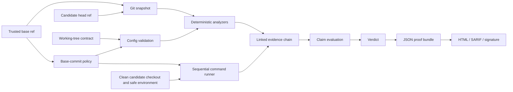

# Architecture

PatchProof is a local TypeScript verification pipeline. It compares two committed Git refs, evaluates the resulting patch with deterministic analyzers and repository commands, maps that evidence onto a claim contract, and emits a portable JSON bundle plus optional projections.

## Verification flow



The asymmetric trust boundary is deliberate: policy is loaded from the trusted base commit unless the caller opts into `--trust-working-policy`. The contract and command execution use the current checkout. When commands are enabled, PatchProof requires that checkout to be clean and at the exact candidate commit both before and after command execution.

## Components

| Area | Implementation | Responsibility |
| --- | --- | --- |
| CLI | `src/cli.ts`, `src/commands/` | Command parsing, output paths, exit codes, key and report workflows |
| Configuration | `src/config/` | Strict YAML parsing, Zod validation, base-commit sealing, cross-document references |
| Git | `src/git/` | Ref resolution, binary-aware diff capture, rename/copy parsing, file-at-ref reads |
| Analyzers | `src/analyzers/` | Deterministic findings and rule evidence |
| Runner | `src/runner/` | Shell command execution, timeout, bounded capture, redaction, process-tree termination |
| Proof | `src/proof/` | Evidence chaining, claims, verdict, bundle hashing, Ed25519, SARIF |
| Models | `src/model/` | Optional contract drafting through Ollama or an OpenAI-compatible endpoint |
| Report | `src/report/` | Escaped, standalone HTML projection of a bundle |
| Orchestrator | `src/engine.ts` | End-to-end ordering and bundle construction |

`src/index.ts` re-exports the supported programmatic surface.

## Git snapshot

Both refs are resolved to commit object IDs before comparison. PatchProof executes the equivalent of:

```sh
git diff --no-ext-diff --binary --find-renames --find-copies --full-index BASE HEAD --
```

The raw diff is retained in the bundle and hashed with SHA-256. Per-file patches, additions, deletions, binary state, rename/copy metadata, and aggregate statistics are derived from that same value. Analyzer file reads use the resolved immutable commit IDs rather than resolving movable branch names again.

The comparison is directly from the selected base commit to the selected head commit; PatchProof does not automatically substitute their merge base. Uncommitted changes are absent from the diff.

## Configuration and trust

Policy loading has two modes:

1. Default: resolve the base ref, read the policy blob from that commit, parse it, and seal the canonical value with the base commit and digest.
2. Explicit: read the working-tree policy and mark the seal source `explicit-file`.

The contract is always read from the configured working-tree path and its canonical value is hashed into the bundle. With command execution enabled, the clean/exact-head guard binds that file to the candidate commit; `--no-commands` skips the guard. Both documents use strict schemas; unknown keys and duplicate IDs fail before analyzers or commands run. Contract references must point to defined policy commands and enabled public rule IDs.

## Deterministic analyzers

Enabled analyzers run concurrently with `Promise.all`; their evidence is collected in registry order. Findings are stable-sorted before claim evaluation.

| Analyzer ID | Behavior |
| --- | --- |
| `policy-integrity` | Blocks changes to recognized PatchProof policy paths or failed base/head comparisons |
| `test-integrity` | Detects deleted test files, newly skipped tests, reduced assertions/test cases, and obvious assertion weakening |
| `secret-scan` | Scans added text lines for supported credential patterns and redacts matched values |
| `dependency-review` | Reviews Node, Python, Go, Rust, Ruby, and PHP manifest/lockfile structure; adds deeper Node manifest checks |
| `scope` | Applies allowed paths, denied paths, and contract `outOfScope` patterns to all changed paths |
| `diff-size` | Enforces changed-file and added-plus-deleted-line limits |
| `missing-test-changes` | Always evaluates policy and contract test-change requirements |

An analyzer emits one rule evidence record. Informational findings leave it `passed`; any warning or blocking finding marks it `failed`. A warning does not directly reject a patch, but failed rule evidence can disprove a blocking claim that depends on that rule.

The analyzers are intentionally conservative heuristics, not parsers or formal verification. Their limitations are catalogued in the [threat model](threat-model.md).

## Command evidence

Configured commands run sequentially after analyzers. Each command receives:

- a small built-in allowlist of operating-system, path, locale, terminal, temporary-directory, and CI variables;
- only the additional host variables named by that command's `inheritEnv` list;
- policy-defined static `env` values; and
- an existing working directory whose real path remains beneath the repository root.

Commands run through the platform shell. Standard output and standard error are captured separately, redacted, and capped at 128 KiB each. The default timeout is five minutes and policy values may range from 100 ms to one hour. A timed-out or aborted command records `error`; a nonzero exit records `failed`; zero records `passed`.

`redactions` contains environment-variable names. Their values are resolved at runtime and never embedded in normalized policy. Output redaction also covers secret-like values present in the command environment and built-in token patterns.

Sequential execution preserves repository command order and avoids concurrent commands mutating the same build artifacts. PatchProof checks the clean exact-head invariant before the first command and after the last command. This is not isolation: a command may still access the network, explicitly inherited credentials, and paths outside the repository through its own arguments or child processes.

## Evidence, claims, and verdict

Analyzer and command drafts are sealed in order. Every evidence digest hashes its canonical record including `previousDigest`, producing an append-sensitive chain. Claims then select evidence by command ID, analyzer ID, changed-path glob, and/or the presence of a test change.

The verdict is computed without a model:

- `rejected` for blocking findings, required-command failure/error, or a disproven blocking claim;
- `incomplete` when required evidence is missing/skipped or any nonblocking claim is disproven or unproven;
- `verified` otherwise.

See [Proof bundle format](proof-bundle.md) for exact semantics.

## Outputs

The JSON bundle is the source of truth. A `contentDigest` commits to every top-level content field other than itself and the optional attestation. Bundle verification also reconstructs file statistics, analyzer finding manifests, claims, and verdicts from the bundled inputs. Other formats are projections:

- HTML embeds all styles, behavior, and a safely encoded bundle for offline inspection.
- SARIF 2.1.0 maps findings to `error`, `warning`, and `note` levels with fingerprints and locations.
- Ed25519 attestation signs its canonical algorithm, public key, content digest, timestamp, and derived key ID.

`patchproof report` verifies bundle consistency and any signature before rendering. `patchproof verify` renders the in-memory bundle it just created.

## Determinism boundaries

Given identical normalized configuration, refs, analyzer implementation, and command results, the substantive findings and claim states are reproducible. Bundle IDs, timestamps, durations, generator platform, command output, and signatures vary by run. Git output can also vary with Git version and repository object availability.

Model output is outside the verification path. It is accepted only after strict contract validation, then reviewed and stored as ordinary YAML.
